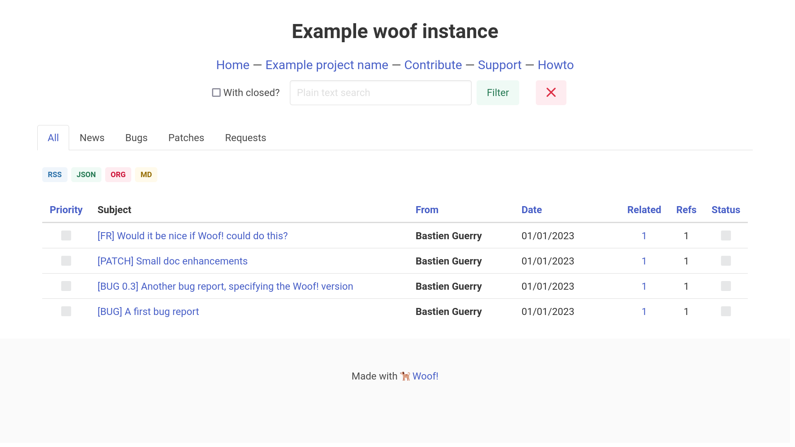

Woof! monitors a mailbox, capture useful email interactions and expose
them on a web page.  Imagine, for example, that your email address is
subscribed to numerous free software development lists and you want to
catch bugs reports, patches, feature requests sent to all these lists:
then you can plug Woof! and have your mailbox monitored, with the most
important information exposed on a web page.

# Howto for casual users

See [the howto](resources/md/howto.md) for basic instructions on how to use Woof!.

# Design rationale

-   **Read only**: Woof! is not a database of issues you need to maintain.
    Useful information is extracted from upstream email interactions,
    emails are the sole source of truth.  So Woof! is read only: there
    is no login, no way to update stuff from the website.

-   **Decentralized**: Since Woof! is based on mailboxes and only reflects
    upstream intereactions, you can have several Woof! instances for the
    same mailing lists: each instance will reflect what is of interest
    for the person who deployed it.

-   **Minimalistic conventions**: Woof! tries to rely on minimalistic and
    realistic conventions for subject prefixes (e.g. [BUG]) and updates
    "triggers" (e.g. "Confirmed.").

-   **Configurable**: Woof! tries to be highly configurable.

# When Woof! can be useful

Woof! is not a full-fledged project management tool: e.g. it does not
allow someone to assign tasks to someone else, to close reports, etc.

Woof! has been developed to help with [Emacs Org-mode](https://orgmode.org/) development where
there is a mailing list with a lot of useful interactions and the need
to promote upcoming changes, bug reports, patches to review, etc.

# Main features

-   Track various report types: bugs, patches, requests, announcements,
    blog posts, changes, releases.
-   Support tracking multiple lists
-   Expose reports as `rss`, `md`, `json` or `org`
-   Expose raw patches when possible.
-   Track related reports and allow to list them
-   Track votes on requests (e.g. `[POLL]`)
-   Allow complex searches
-   Themes
-   i18n

# Upcoming

There is no roadmap as I develop Woof! in my spare time, but here is a
list of ideas for future versions.

1.  [ ] Separate woof-server (api + webhook endpoint) from woof-web
2.  [ ] Expose data through GraphQL
3.  [ ] Better hero header search line
4.  [ ] Add pagination
5.  [ ] Add "events" as the last (?) report type
6.  [ ] Implement notifications and digests
7.  [ ] Allow to set individual notifications based on subject
8.  [ ] Complete the use of integrant (to stop)
9.  [ ] Allow webhook ?
10. [ ] Start implementing the overview page

# Setting up and running Woof!

## Requisits

Woof! requires Clojure and Java:

-   Run `~$ apt install clojure` or see [this guide](https://clojure.org/guides/getting_started).
-   Run `~$ apt install default-jre` or refer to your distribution.

## Configure

You need to copy `config_example.edn` as `config.edn` and to set
environment variables: see <config_example.edn> for the list.

`config_example.edn` also contains other configuration parameters that
you need to set.  You can also refer to <src/bzg/config.clj> which
contains other configuration defaults.

## Test

Once you're done configuring Woof!, check your configuration:

    ~$ clj -M:test

## Run with deps.edn

Run with:

    ~$ clj -M:run

Deploy with:

    ~$ clj -M:uberdeps
    ~$ java -cp target/woof.jar clojure.main -m bzg.init

## Run with leiningen

Run with:

    ~$ lein run

Deploy with:

    ~$ lein uberjar
    ~$ java -jar target/woof.jar

# Contributing

Contributions are welcome!  See .

Suggested contributions:

-   Write a new HTML theme
-   Support new UI languages
-   Enhance the documentation
-   Add tests
-   Report bugs
-   Enhance performance and accessibility

# Support the Clojure(script) ecosystem

If you like Clojure(script), please consider supporting maintainers by
donating to [clojuriststogether.org](https://www.clojuriststogether.org).

# License

© Bastien Guerry 2020-2022

Woof is released under [the EPL 2.0 license](LICENSES/EPL-2.0.txt).

